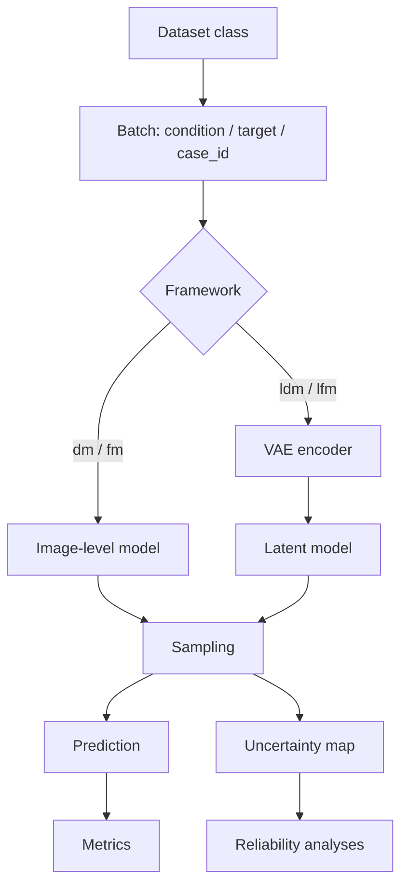

# TRUST / Latent-UQ

A task-agnostic framework for uncertainty-aware diffusion and flow-matching models.

TRUST / Latent-UQ provides a unified interface for:

- image-level Diffusion Models (`dm`);
- image-level Flow Matching (`fm`);
- Latent Diffusion Models (`ldm`);
- Latent Flow Matching (`lfm`);
- base generation, heteroscedastic aleatoric uncertainty, and uncertainty-guided self-conditioning;
- selectable inference analyses through YAML or CLI flags;
- dataset integration through one standardized dataset interface.

The key design principle is:

> Add new tasks by changing the dataset configuration, not by editing training or inference scripts.

---

## 1. Supported frameworks and modes

| Framework | Meaning | Data space |
|---|---|---|
| `dm` | Diffusion Model | image space |
| `fm` | Flow Matching | image space |
| `ldm` | Latent Diffusion Model | latent space |
| `lfm` | Latent Flow Matching | latent space |

Accepted CLI aliases:

| Alias | Normalized framework |
|---|---|
| `ddpm`, `diffusion` | `dm` |
| `rf`, `flow`, `flow_matching` | `fm` |

| Mode | Meaning | Expected model output |
|---|---|---|
| `base` | standard generator | prediction |
| `aleatoric` | heteroscedastic uncertainty head | prediction + log-variance |
| `selfcond` | uncertainty-guided self-conditioning | prediction + uncertainty + context feedback |

---

## 2. High-level workflow



The standardized batch contract is:

```python
{
    "condition": condition_tensor,
    "target": target_tensor,
    "case_id": case_id,
}
```

Datasets that still return historical keys such as `A` and `B` are automatically adapted to `condition` and `target`.

---

## 3. Repository structure

```text
TRUST_refactored/
├── configs/
│   ├── datasets/          # dataset YAML examples/snippets
│   ├── train/             # full training YAML examples
│   └── inference/         # full inference YAML examples
├── scripts/
│   ├── train.py           # unified training entrypoint
│   └── infer.py           # unified inference entrypoint
├── latent_uq/
│   ├── data/              # dataset factory, adapters, built-in dataset aliases
│   ├── models/            # backbone/VAE/context factories and reference models
│   ├── losses/            # heteroscedastic loss and custom loss extension point
│   ├── training/          # generic task-agnostic training loop
│   ├── inference/         # analysis selection and validation
│   ├── schedulers/        # scheduler factory
│   ├── backends/          # adapters to bundled historical model/sampling code
│   └── utils/             # dynamic import utilities
├── src/                   # bundled historical model, VAE and inference implementations
├── examples/              # minimal examples for custom datasets
├── scripts_bash/          # example shell launchers
├── tests/
│   └── smoke_imports.py
├── CONFIG_REFERENCE.md
└── README.md
```

---

## 4. What is still considered a backend?

The public entrypoints are only:

```bash
python scripts/train.py
python scripts/infer.py
```

Internally, `latent_uq/backends/` contains adapters to the historical model and sampling functions under `src/`. These backend adapters are still used to run the existing DM/FM/LDM/LFM implementations. However, dataset construction has been moved outside backend code.

In other words:

- datasets are built centrally by `latent_uq.data.factory.build_dataset()`;
- inference batches are passed to backend adapters as standardized tensors;
- backend adapters should not decide which dataset to load;
- old standalone backend inference scripts are not part of the public API;
- historical training scripts remain available only through `training.backend: legacy`.

For new work, use:

```yaml
training:
  backend: generic
```

The legacy backend is only for reproducing historical project-specific training behaviour.

---

## 5. Installation

```bash
conda create -n trust-uq python=3.10
conda activate trust-uq
pip install -r requirements.txt
pip install -e .
```

Check imports and built-in dataset aliases:

```bash
python tests/smoke_imports.py
```

---

## 6. Quick start

### Training dry-run

```bash
python scripts/train.py \
  --config configs/train/dm_aleatoric.yaml \
  --dry-run
```

### Training

```bash
python scripts/train.py \
  --config configs/train/dm_aleatoric.yaml
```

### Inference dry-run

```bash
python scripts/infer.py \
  --config configs/inference/ldm_aleatoric.yaml \
  --dry-run
```

### Inference

```bash
python scripts/infer.py \
  --config configs/inference/ldm_aleatoric.yaml
```

---

## 7. Dataset integration

Datasets are selected using the YAML block:

```yaml
data:
  dataset_class: ...
  dataset_kwargs: ...
  scaling_factor: 1.0
```

The rest of the framework consumes only standardized batches:

```python
batch["condition"]
batch["target"]
batch["case_id"]
```

### 7.1 Add a new dataset

Create a dataset class that returns `condition`, `target`, and optionally `case_id`.

```python
from latent_uq.data.base import BasePairedDataset

class MyDataset(BasePairedDataset):
    def __init__(self, root, split="train"):
        self.root = root
        self.split = split
        self.samples = ...

    def __len__(self):
        return len(self.samples)

    def __getitem__(self, index):
        condition = ...  # torch.Tensor, e.g. [C, H, W] or [C, D, H, W]
        target = ...     # torch.Tensor
        return {
            "condition": condition,
            "target": target,
            "case_id": f"case_{index:04d}",
        }
```

Then set the dataset in your YAML:

```yaml
data:
  dataset_class: my_project.datasets.MyDataset
  dataset_kwargs:
    root: /path/to/data
    split: train
  scaling_factor: 1.0
```

No framework code needs to be modified.

### 7.2 Use a dataset that returns custom keys

If your dataset returns keys different from `condition` and `target`, specify them:

```yaml
data:
  dataset_class: my_project.datasets.MyDataset
  condition_key: source
  target_key: label
  dataset_kwargs:
    root: /path/to/data
    split: test
```

The adapter will internally standardize the batch to:

```python
batch["condition"]
batch["target"]
```

---

## 8. Built-in dataset aliases

The repository preserves the datasets historically used by the backend scripts. They are exposed through aliases and are ready to use from YAML.

| Alias | Dataset | Main required arguments |
|---|---|---|
| `denoising`, `ldct`, `ldct_hdct` | LDCT → HDCT | `annotation_A`, `annotation_B` |
| `denoising_autokl`, `ldct_autokl` | LDCT/HDCT AutoKL variant | `annotation_A`, `annotation_B` |
| `t1t2` | T1 → T2 MRI | `annotation_A`, `annotation_B` |
| `t1motion`, `t1_motion`, `motion_t1` | motion-corrupted T1 → clean T1 | `annotation_A`, `annotation_B` |
| `ctpet` | CT → PET CSV dataset | `annotation_A` |
| `mri2d`, `mri2d_slice`, `t1t2_oasis` | generic multi-modal MRI 2D slice dataset | `dataroot`, `mri_modalities`, `slice_range` |
| `cityscapes`, `cs` | Cityscapes paired dataset | `root`, `split` |
| `nd`, `natural_denoising` | generic paired natural-image dataset | `csv_path`, `root_dir` |
| `mrtoct`, `mr_ct` | MR → CT | `csv_path` |
| `cbcttoct`, `cbct_ct` | CBCT → CT | `csv_path` |

### LDCT denoising

```yaml
data:
  dataset_class: denoising
  dataset_kwargs:
    annotation_A: /path/to/lowdose.csv
    annotation_B: /path/to/fulldose.csv
  scaling_factor: 7.832608
```

### T1/T2 MRI

```yaml
data:
  dataset_class: t1t2
  dataset_kwargs:
    annotation_A: /path/to/t1_annotations.csv
    annotation_B: /path/to/t2_annotations.csv
  scaling_factor: 9.404202
```

### T1 motion correction

```yaml
data:
  dataset_class: t1motion
  dataset_kwargs:
    annotation_A: /path/to/t1_annotations.csv
    annotation_B: /path/to/t1_clean_annotations.csv
    mode: test
    fixed_motion_level: 0.15
  scaling_factor: 9.404202
```

### CT/PET CSV dataset

```yaml
data:
  dataset_class: ctpet
  dataset_kwargs:
    annotation_A: /path/to/ct_pet_pairs.csv
  scaling_factor: 1.0
```

### Multi-modal MRI 2D slices

```yaml
data:
  dataset_class: mri2d
  dataset_kwargs:
    dataroot: /path/to/mri/root
    mri_modalities: [t1n, t1c, t2w, t2f]
    slice_range: [0, 999]
    phase: test
    under_sample_dataset: false
  scaling_factor: 1.0
```

### MR-to-CT

```yaml
data:
  dataset_class: mrtoct
  dataset_kwargs:
    csv_path: /path/to/mr_ct_dataset.csv
    output_size: 256
  scaling_factor: 6.640712
```

### CBCT-to-CT

```yaml
data:
  dataset_class: cbcttoct
  dataset_kwargs:
    csv_path: /path/to/cbct_ct_dataset.csv
    output_size: 256
  scaling_factor: 9.744896
```

### Cityscapes

```yaml
data:
  dataset_class: cityscapes
  dataset_kwargs:
    root: /path/to/cityscapes
    split: train
    resize: [256, 512]
  scaling_factor: 1.0
```

### Natural-image paired dataset

```yaml
data:
  dataset_class: nd
  dataset_kwargs:
    csv_path: /path/to/pairs.csv
    root_dir: /path/to/root
    resize: [272, 480]
  scaling_factor: 1.0
```

---

## 9. What is `configs/datasets/`?

`configs/datasets/` contains dataset configuration examples, not separate entrypoints.

These files show how to write the `data:` block for a specific dataset. They are useful as copy/paste templates.

Important: the current YAML loader does not implement YAML includes. Therefore, a file such as:

```text
configs/datasets/denoising.yaml
```

is not automatically imported by:

```text
configs/train/dm_aleatoric.yaml
configs/inference/ldm_aleatoric.yaml
```

To use one of these dataset examples, copy its `data:` block into the train/inference config you want to run.

---

## 10. Training configuration

Training uses:

```bash
python scripts/train.py --config <config.yaml>
```

Default recommended backend:

```yaml
training:
  backend: generic
```

The generic backend supports:

- custom datasets through `data.dataset_class`;
- custom backbones through `model.backbone_class`;
- custom VAEs through `model.vae_class`;
- custom losses through `training.loss_class`.

### Minimal training config

```yaml
run:
  framework: dm
  mode: aleatoric
  output_dir: outputs/checkpoints
  experiment_name: dm_aleatoric_experiment

model:
  in_ch: 2
  out_ch: 1

data:
  dataset_class: denoising
  dataset_kwargs:
    annotation_A: /path/to/lowdose.csv
    annotation_B: /path/to/fulldose.csv
  scaling_factor: 7.832608

training:
  backend: generic
  batch_size: 2
  num_workers: 4
  n_epochs: 1
  lr: 1.5e-5
```

### Historical training backend

For exact compatibility with historical project-specific training scripts, set:

```yaml
training:
  backend: legacy
```

The legacy backend may still contain task-specific assumptions. For new tasks and new datasets, prefer `backend: generic`.

---

## 11. Custom backbone, VAE and loss

### Custom U-Net/backbone

```yaml
model:
  backbone_class: my_project.models.MyUNet
  backbone_kwargs:
    in_channels: 2
    out_channels: 1
    features: 64
```

For uncertainty-aware modes, the model should return either:

```python
(prediction, logvar)
```

or:

```python
{
    "prediction": prediction,
    "logvar": logvar,
}
```

For `base` mode it may return only `prediction`.

### Custom VAE, including a 3D VAE

Latent frameworks (`ldm`, `lfm`) use a VAE/autoencoder before the generative model.

```yaml
model:
  vae_class: my_project.models.VAE3D
  vae_kwargs:
    in_channels: 1
    latent_channels: 4
    spatial_dims: 3
  vae_ckpt: /path/to/vae_checkpoint.pth
```

The VAE should expose either:

```python
vae(x) -> (..., latent, ...)
```

or:

```python
vae.encode(x) -> latent
vae.decode(z) -> reconstruction
```

### Custom loss

```yaml
training:
  loss_class: my_project.losses.MyLoss
  loss_kwargs:
    weight: 1.0
```

If no custom loss is specified:

- `base` uses MSE;
- `aleatoric` and `selfcond` use `HeteroscedasticLoss`.

---

## 12. Inference configuration

Inference uses:

```bash
python scripts/infer.py --config <config.yaml>
```

Example:

```yaml
run:
  framework: ldm
  mode: aleatoric
  task: custom
  output_dir: outputs
  experiment_name: ldm_aleatoric_experiment
  epoch: latest
  checkpoint_root: checkpoints

model:
  in_ch: 2
  out_ch: 1
  vae_ckpt: /path/to/vae/checkpoint_dir
  diff_ckpt: /path/to/diffusion_checkpoint.pth
  context_ckpt: null

data:
  dataset_class: denoising
  dataset_kwargs:
    annotation_A: /path/to/lowdose.csv
    annotation_B: /path/to/fulldose.csv
  scaling_factor: 7.832608

inference:
  batch_size: 1
  num_workers: 4
  num_inference_steps: 50
  K: 10
  seed: 0

analysis:
  metrics: true
  sparsification: false
  spatial_error_correlation: false
  calibration_bins: false
```

---

## 13. Selecting analyses during inference

Enable analyses in YAML:

```yaml
analysis:
  metrics: true
  sparsification: true
  spatial_error_correlation: true
  calibration_bins: true
```

or override them from CLI:

```bash
python scripts/infer.py \
  --config configs/inference/ldm_self_conditioned.yaml \
  --analyses metrics sparsification spatial_error_correlation calibration_bins
```

Backward-compatible aliases:

| Old name | New name |
|---|---|
| `uncertainty_eval` | `spatial_error_correlation` |
| `uncertainty_cal` | `calibration_bins` |
| `metrics_no_uncertainty` | `metrics` |

### Analysis compatibility

| Mode | `metrics` | `sparsification` | `spatial_error_correlation` | `calibration_bins` |
|---|---:|---:|---:|---:|
| `base` | yes | no | no | no |
| `aleatoric` | yes | yes | no | no |
| `selfcond` | yes | yes | yes | yes |

Invalid combinations are rejected before inference starts.

---

## 14. Output files

Inference writes one CSV per enabled analysis under the resolved output directory.

Typical metric columns include:

```text
case_id
psnr
ssim
mae
u_mean
u_p95
u_p99
u_top1_mean
u_top5_mean
```

The exact columns depend on the enabled analysis and on the underlying historical metric writer.

---

## 15. Recommended extension patterns

| Goal | What to modify |
|---|---|
| Add a new task | add a dataset class and edit YAML `data:` block |
| Use an existing bundled dataset | set `data.dataset_class` to a built-in alias |
| Use a new U-Net/DiT/backbone | set `model.backbone_class` |
| Use a 3D VAE | set `model.vae_class` |
| Use a new loss | set `training.loss_class` |
| Enable/disable analyses | edit YAML `analysis:` or use `--analyses` |

---

## 16. Troubleshooting

### `ModuleNotFoundError: latent_uq`

Run:

```bash
pip install -e .
```

from the repository root.

### Dataset returns wrong keys

The dataset must return either:

```python
condition / target
```

or historical:

```python
A / B
```

If using other keys, set:

```yaml
data:
  condition_key: source
  target_key: label
```

### I added a new dataset but the backend does not see it

Use the public entrypoints:

```bash
python scripts/train.py
python scripts/infer.py
```

and configure the dataset through YAML. Do not call old backend scripts directly.

### I want exact historical training behaviour

Use:

```yaml
training:
  backend: legacy
```

For new datasets and new tasks, use:

```yaml
training:
  backend: generic
```
